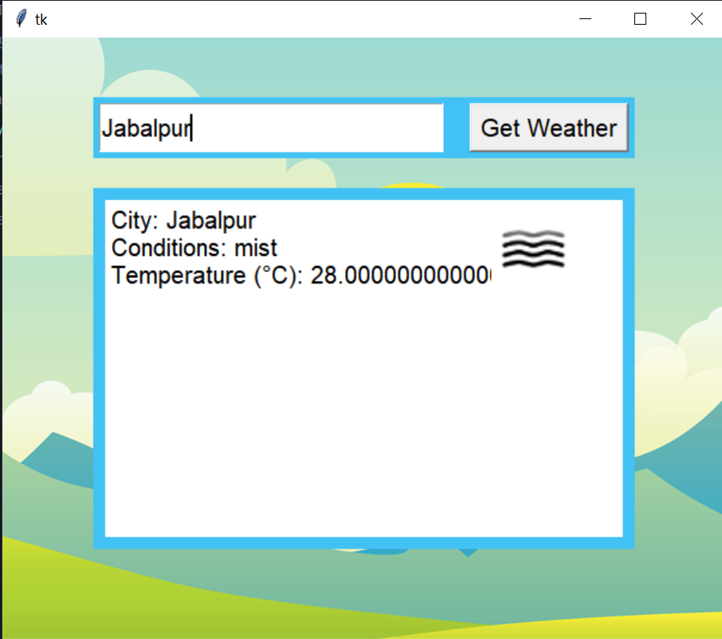

# Weather GUI 

## Used :
* Python 3
* Tkinter

## Give it a try:

## Installation:

* Run `get_weather_icons.py`
* You will get all the Assets
* Run `WeatherApp.py` for Simple & No icons GUI
* Run `WeatherApp_icons.py` for Beautiful GUI with All images and icons.

###  Here's the demo:

### 

 *If You Like it, Give this Repo. a ⭐* 

 
